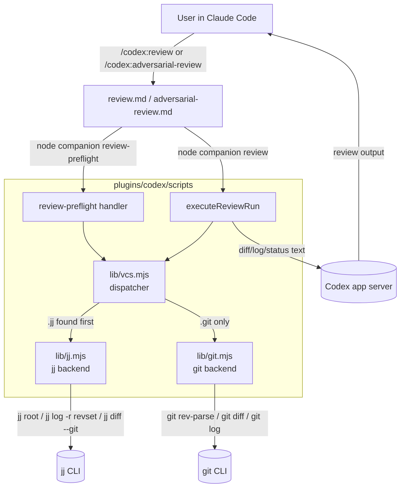

# Codex plugin for Claude Code (Jujutsu-first fork)

Use Codex from inside Claude Code for code reviews or to delegate tasks to Codex.

This is a fork of [`openai/codex-plugin-cc`](https://github.com/openai/codex-plugin-cc) adapted to be **Jujutsu-first** while keeping full Git support. In a [jj](https://github.com/jj-vcs/jj) repo, `/codex:review` and `/codex:adversarial-review` default to "the chain of revisions since the closest ancestor bookmark of `@`" — your current chain of thought, not your whole branch.

<video src="./docs/plugin-demo.webm" controls muted playsinline autoplay></video>

## What this fork changes

Compared to upstream, this fork:

- **Adds a VCS dispatcher** that auto-detects whether `cwd` lives inside a `.jj/` or `.git/` repo (jj wins in colocated repos) and routes review commands to the matching backend.
- **Adds a Jujutsu backend** alongside the existing git backend. The jj backend implements the same surface (`ensureRepository`, `resolveReviewTarget`, `collectReviewContext`, etc.) using `jj` commands and emits diffs in `--git` format so the Codex review prompt is unchanged.
- **Redefines `auto` scope for jj**: the default review target is the chain `heads(::@- & bookmarks())..@` — i.e., everything since the closest ancestor bookmark of `@`. If `@` is itself bookmarked, the chain skips past it. With no ancestor bookmark, it falls back to `trunk()..@`.
- **Repurposes `--scope working-tree` and `--scope branch` in jj mode**: working-tree means `@-..@` (just the working-copy commit's diff); branch means `trunk()..@`. `--base <revset>` accepts any jj revset.
- **Adds a `review-preflight` companion subcommand** that returns `vcs / target_label / file_count / lines_added / lines_removed / recommendation`. The two review command markdowns now call this single VCS-agnostic helper instead of running git-specific shell commands inline.
- **Treats jj workspaces as first-class** (`jj workspace add ...`). No extra configuration — each workspace has its own `@` and the plugin uses whichever one `cwd` lives in.

Git-only users see no behavior change: `git.mjs` is untouched, all existing git tests still pass.

## Architecture



The dispatcher caches detection by `cwd`, so within a single command invocation we walk the filesystem at most once per directory. The jj backend exclusively uses revsets (`heads(...)`, `<base>..@`, `trunk()`, `@-`, `@`) so there are no special cases for detached HEADs, missing branches, or remote tracking — the revset language handles them uniformly.

## What You Get

- `/codex:review` for a normal read-only Codex review (jj: chain since last bookmark; git: working tree or branch)
- `/codex:adversarial-review` for a steerable challenge review (same scope semantics as `/codex:review`)
- `/codex:rescue`, `/codex:status`, `/codex:result`, and `/codex:cancel` to delegate work and manage background jobs (VCS-agnostic)

## Requirements

- **ChatGPT subscription (incl. Free) or OpenAI API key.**
  - Usage will contribute to your Codex usage limits. [Learn more](https://developers.openai.com/codex/pricing).
- **Node.js 18.18 or later**
- **Jujutsu** ([jj-vcs/jj](https://github.com/jj-vcs/jj)) or **Git**. The plugin auto-detects which one your repo uses; in a colocated `.jj/` + `.git/` repo it prefers jj.

## VCS support

Both Git and Jujutsu work out of the box. The plugin walks up from `cwd` looking for `.jj/` first, then `.git/`. The semantics of `--scope` differ slightly between the two:

| Scope | Git | Jujutsu |
|---|---|---|
| `auto` (default) | dirty? working tree : diff vs default branch | **chain since closest ancestor bookmark of `@`** (skips past `@`'s own bookmark; falls back to `trunk()..@`) |
| `working-tree` | staged + unstaged + untracked | `@-..@` (the working-copy commit's diff) |
| `branch` | diff vs detected default branch | `trunk()..@` |
| `--base <ref>` | git diff vs `<ref>` | `<ref>..@`, where `<ref>` is any valid jj revset |

### Working in jj workspaces

[`jj workspace add`](https://jj-vcs.github.io/jj/latest/working-copy/#workspaces) is fully supported — each workspace has its own `@`, and the plugin uses whichever workspace `cwd` lives in. No special configuration needed.

## Install

This fork is meant to be installed from a local clone (not from a published marketplace). The repo ships its own `.claude-plugin/marketplace.json` so Claude Code can read it directly off disk.

**Step 1 — clone the fork:**

```bash
git clone https://github.com/skeswa/codex-plugin-cc.git
cd codex-plugin-cc
```

**Step 2 — register the local checkout as a Claude Code marketplace.** Use an absolute path. `pwd` works inside the cloned directory; otherwise pass the full path explicitly. In Claude Code:

```
/plugin marketplace add /absolute/path/to/codex-plugin-cc
```

The marketplace name is `codex-jj` (defined in `.claude-plugin/marketplace.json`).

**Step 3 — install the plugin from that marketplace:**

```
/plugin install codex@codex-jj
```

**Step 4 — reload so the slash commands appear:**

```
/reload-plugins
```

After this you should see `/codex:review`, `/codex:adversarial-review`, `/codex:rescue`, etc., plus the `codex:codex-rescue` subagent under `/agents`.

**Step 5 — verify Codex itself is ready:**

```
/codex:setup
```

`/codex:setup` will tell you whether Codex is ready. If Codex is missing and npm is available, it can offer to install Codex for you.

### Updating after you pull or edit the fork

Claude Code copies the plugin to `~/.claude/plugins/cache/` at install time, so edits to your local checkout are not picked up automatically. After a `git pull` or local edits:

```
/plugin marketplace update codex-jj
/plugin install codex@codex-jj
/reload-plugins
```

If you're iterating heavily, you can drop the `version` field from `.claude-plugin/marketplace.json` and `plugins/codex/.claude-plugin/plugin.json` — Claude Code then treats every git commit as a new version and refreshes on `marketplace update`.

Reference: [Claude Code plugin marketplaces docs](https://code.claude.com/docs/en/plugin-marketplaces).

If you prefer to install the Codex CLI yourself instead of letting `/codex:setup` do it:

```bash
npm install -g @openai/codex
```

If Codex is installed but not logged in yet, run:

```bash
!codex login
```

A simple first run is:

```bash
/codex:review --background
/codex:status
/codex:result
```

## Usage

### `/codex:review`

Runs a normal Codex review on your current work. It gives you the same quality of code review as running `/review` inside Codex directly.

> [!NOTE]
> Code review especially for multi-file changes might take a while. It's generally recommended to run it in the background.

Use it when you want:

- a review of your current chain of revisions in jj (everything since your last bookmark)
- a review of your branch compared to a base branch like `main` in git
- a review of just the working-copy commit (`--scope working-tree`)

Use `--base <ref>` to override the comparison base in either VCS. It also supports `--wait` and `--background`. It is not steerable and does not take custom focus text. Use [`/codex:adversarial-review`](#codexadversarial-review) when you want to challenge a specific decision or risk area. See [VCS support](#vcs-support) for the full scope semantics.

Examples:

```bash
/codex:review                          # jj: chain since last bookmark | git: working tree or branch
/codex:review --base main              # diff against main
/codex:review --scope working-tree     # jj: @-..@ | git: uncommitted changes
/codex:review --background
```

This command is read-only and will not perform any changes. When run in the background you can use [`/codex:status`](#codexstatus) to check on the progress and [`/codex:cancel`](#codexcancel) to cancel the ongoing task.

### `/codex:adversarial-review`

Runs a **steerable** review that questions the chosen implementation and design.

It can be used to pressure-test assumptions, tradeoffs, failure modes, and whether a different approach would have been safer or simpler.

It uses the same review target selection as `/codex:review`, including `--base <ref>` for branch review.
It also supports `--wait` and `--background`. Unlike `/codex:review`, it can take extra focus text after the flags.

Use it when you want:

- a review before shipping that challenges the direction, not just the code details
- review focused on design choices, tradeoffs, hidden assumptions, and alternative approaches
- pressure-testing around specific risk areas like auth, data loss, rollback, race conditions, or reliability

Examples:

```bash
/codex:adversarial-review
/codex:adversarial-review --base main challenge whether this was the right caching and retry design
/codex:adversarial-review --background look for race conditions and question the chosen approach
```

This command is read-only. It does not fix code.

### `/codex:rescue`

Hands a task to Codex through the `codex:codex-rescue` subagent.

Use it when you want Codex to:

- investigate a bug
- try a fix
- continue a previous Codex task
- take a faster or cheaper pass with a smaller model

> [!NOTE]
> Depending on the task and the model you choose these tasks might take a long time and it's generally recommended to force the task to be in the background or move the agent to the background.

It supports `--background`, `--wait`, `--resume`, and `--fresh`. If you omit `--resume` and `--fresh`, the plugin can offer to continue the latest rescue thread for this repo.

Examples:

```bash
/codex:rescue investigate why the tests started failing
/codex:rescue fix the failing test with the smallest safe patch
/codex:rescue --resume apply the top fix from the last run
/codex:rescue --model gpt-5.4-mini --effort medium investigate the flaky integration test
/codex:rescue --model spark fix the issue quickly
/codex:rescue --background investigate the regression
```

You can also just ask for a task to be delegated to Codex:

```text
Ask Codex to redesign the database connection to be more resilient.
```

**Notes:**

- if you do not pass `--model` or `--effort`, Codex chooses its own defaults.
- if you say `spark`, the plugin maps that to `gpt-5.3-codex-spark`
- follow-up rescue requests can continue the latest Codex task in the repo

### `/codex:status`

Shows running and recent Codex jobs for the current repository.

Examples:

```bash
/codex:status
/codex:status task-abc123
```

Use it to:

- check progress on background work
- see the latest completed job
- confirm whether a task is still running

### `/codex:result`

Shows the final stored Codex output for a finished job.
When available, it also includes the Codex session ID so you can reopen that run directly in Codex with `codex resume <session-id>`.

Examples:

```bash
/codex:result
/codex:result task-abc123
```

### `/codex:cancel`

Cancels an active background Codex job.

Examples:

```bash
/codex:cancel
/codex:cancel task-abc123
```

### `/codex:setup`

Checks whether Codex is installed and authenticated.
If Codex is missing and npm is available, it can offer to install Codex for you.

You can also use `/codex:setup` to manage the optional review gate.

#### Enabling review gate

```bash
/codex:setup --enable-review-gate
/codex:setup --disable-review-gate
```

When the review gate is enabled, the plugin uses a `Stop` hook to run a targeted Codex review based on Claude's response. If that review finds issues, the stop is blocked so Claude can address them first.

> [!WARNING]
> The review gate can create a long-running Claude/Codex loop and may drain usage limits quickly. Only enable it when you plan to actively monitor the session.

## Typical Flows

### Review Before Shipping

```bash
/codex:review
```

### Hand A Problem To Codex

```bash
/codex:rescue investigate why the build is failing in CI
```

### Start Something Long-Running

```bash
/codex:adversarial-review --background
/codex:rescue --background investigate the flaky test
```

Then check in with:

```bash
/codex:status
/codex:result
```

## Codex Integration

The Codex plugin wraps the [Codex app server](https://developers.openai.com/codex/app-server). It uses the global `codex` binary installed in your environment and [applies the same configuration](https://developers.openai.com/codex/config-basic).

### Common Configurations

If you want to change the default reasoning effort or the default model that gets used by the plugin, you can define that inside your user-level or project-level `config.toml`. For example to always use `gpt-5.4-mini` on `high` for a specific project you can add the following to a `.codex/config.toml` file at the root of the directory you started Claude in:

```toml
model = "gpt-5.4-mini"
model_reasoning_effort = "high"
```

Your configuration will be picked up based on:

- user-level config in `~/.codex/config.toml`
- project-level overrides in `.codex/config.toml`
- project-level overrides only load when the [project is trusted](https://developers.openai.com/codex/config-advanced#project-config-files-codexconfigtoml)

Check out the Codex docs for more [configuration options](https://developers.openai.com/codex/config-reference).

### Moving The Work Over To Codex

Delegated tasks and any [stop gate](#what-does-the-review-gate-do) run can also be directly resumed inside Codex by running `codex resume` either with the specific session ID you received from running `/codex:result` or `/codex:status` or by selecting it from the list.

This way you can review the Codex work or continue the work there.

## FAQ

### Do I need a separate Codex account for this plugin?

If you are already signed into Codex on this machine, that account should work immediately here too. This plugin uses your local Codex CLI authentication.

If you only use Claude Code today and have not used Codex yet, you will also need to sign in to Codex with either a ChatGPT account or an API key. [Codex is available with your ChatGPT subscription](https://developers.openai.com/codex/pricing/), and [`codex login`](https://developers.openai.com/codex/cli/reference/#codex-login) supports both ChatGPT and API key sign-in. Run `/codex:setup` to check whether Codex is ready, and use `!codex login` if it is not.

### Does the plugin use a separate Codex runtime?

No. This plugin delegates through your local [Codex CLI](https://developers.openai.com/codex/cli/) and [Codex app server](https://developers.openai.com/codex/app-server/) on the same machine.

That means:

- it uses the same Codex install you would use directly
- it uses the same local authentication state
- it uses the same repository checkout and machine-local environment

### Will it use the same Codex config I already have?

Yes. If you already use Codex, the plugin picks up the same [configuration](#common-configurations).

### Can I keep using my current API key or base URL setup?

Yes. Because the plugin uses your local Codex CLI, your existing sign-in method and config still apply.

If you need to point the built-in OpenAI provider at a different endpoint, set `openai_base_url` in your [Codex config](https://developers.openai.com/codex/config-advanced/#config-and-state-locations).
